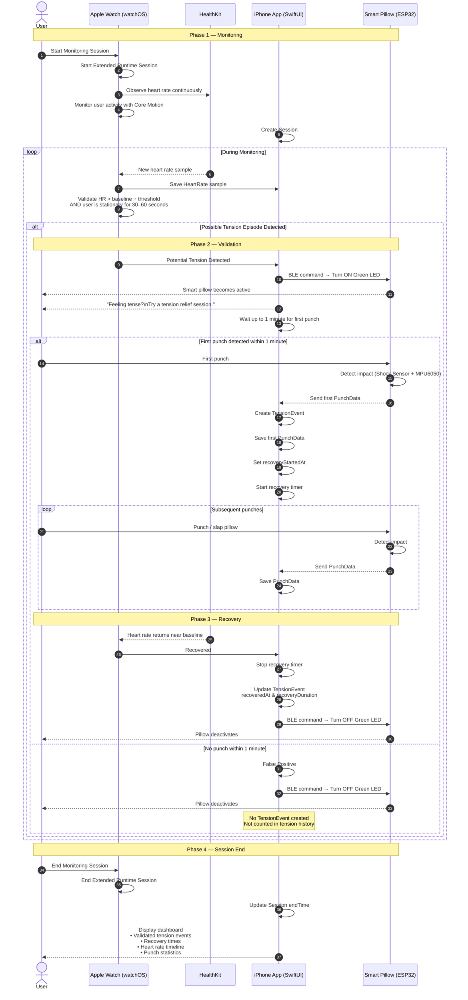

# Tech & Framework Challenge

> A project-based challenge that encourages teams to explore Apple technologies, experiment with Apple frameworks, and transform their learnings into a functional application.

This repository documents our team's journey throughout the **Tech & Framework Challenge**, where each team selects a technology theme, researches Apple's frameworks, explores different approaches, and develops a solution while documenting the entire engineering process—from initial assumptions to the final design decisions.

For this challenge, our team chose the **Internet of Things (IoT)** theme and built **[App Name]**, an application that integrates Apple frameworks with an IoT-enabled smart pillow to detect potential tension episodes based on elevated heart rate during periods of inactivity, encourage users to perform a guided tension-relief session, and provide recovery analytics through an dashboard.

---

# 📖 Overview

Periods of tension can build up gradually during work or study sessions. While wearable devices can continuously monitor physiological signals, they rarely provide an immediate, interactive response.

Our project explores how Apple frameworks can be combined with Internet of Things (IoT) technologies to bridge this gap. By leveraging **HealthKit**, **Core Motion**, and **Core Bluetooth**, the application monitors heart rate and user activity to identify potential tension episodes based on elevated heart rate during periods of inactivity. When a potential tension episode is detected, the application communicates with a Bluetooth-enabled smart pillow, prompting users to engage in a guided tension-relief session. Following each validated tension event, users can review their recovery through an interactive analytics dashboard, including heart rate trends, recovery time, and punch statistics.

---

# ✨ Key Features

- ❤️ Continuous heart rate monitoring using Apple Watch
- 🧍 Stationary activity detection with Core Motion
- 🎯 Detection of potential tension episodes based on elevated heart rate during inactivity
- 📡 BLE communication with an ESP32-powered smart pillow
- 🥊 Interactive guided tension-relief sessions
- 📊 Recovery analytics dashboard with heart rate trends, recovery time, and punch statistics
- 🔄 Real-time integration between Apple frameworks and IoT hardware
---

# 👥 Team
**Team Name:** IoTry

| Name | Role |
|------|------|
| Ahmad Taufiq Hidayat | Coder |
| Johnny Khang | Coder |
| Stevanus Felixiano | Coder |
| Valentica Ongke | Designer |
| Ni Ketut Lela Berliani | Designer |

---

# 🎯 Challenge Theme

Among several available challenge themes, we chose **Internet of Things (IoT)** because we wanted to explore how Apple frameworks can interact with physical devices rather than remaining purely software-based.

### Theme
- Internet of Things (IoT)

### Apple Frameworks
- **Core Bluetooth** *(Primary Framework)*
- **HealthKit**
- **Core Motion**

---

# 💡 Problem Statement

Many wearable applications can detect changes in physiological signals, but few provide an immediate, interactive response.

We wanted to answer a different question:

> **What if physiological changes could trigger an IoT-enabled device that encourages users to engage in a guided tension-relief session and track their recovery?**
---

# 🚀 Proposed Solution
Our solution consists of two main stages: **potential tension detection** and **guided tension relief**.

### Potential Tension Detection

- HealthKit continuously monitors heart rate using Apple Watch.
- Core Motion determines whether the user is stationary.
- Elevated heart rate during periods of inactivity is identified as a **potential tension episode**.
- The application prompts the user to interact with the IoT-enabled smart pillow.
- If the user responds by punching the pillow within one minute, the event is validated as a tension event. Otherwise, it is treated as a false positive and is not recorded.

### Guided Tension Relief

- Core Bluetooth communicates with an ESP32-powered smart pillow.
- The pillow provides a visual cue by activating its LED.
- Users perform a guided tension-relief session by interacting with the pillow.
- The first punch starts recovery monitoring, while subsequent punches are recorded throughout the session.
- Apple Watch continues monitoring heart rate until it returns near the user's baseline.
- Recovery metrics and session analytics are presented through an interactive dashboard.
---

# 🛠 Framework Integration

| Framework | Purpose |
|-----------|---------|
| **Core Bluetooth** | Communicates with the ESP32-powered smart pillow using Bluetooth Low Energy (BLE). |
| **HealthKit** | Continuously monitors the user's heart rate using Apple Watch. |
| **Core Motion** | Verifies that the user is stationary to improve the accuracy of potential tension episode detection. |
---

## Core Bluetooth *(Primary Framework)*

### Why We Chose It

Core Bluetooth enables seamless BLE communication between the iOS application and our custom IoT device. It acts as the bridge between digital health monitoring and physical interaction, making it the foundation of our solution.

### Responsibilities

- Discover nearby BLE devices
- Pair with the smart pillow
- Send activation commands
- Receive sensor data from the ESP32

---

## HealthKit

### Why We Chose It

HealthKit provides access to heart rate data collected by Apple Watch, enabling our application to monitor physiological changes throughout each monitoring session.

### Responsibilities
Read continuous heart rate data from Apple Watch

---

## Core Motion

### Why We Chose It

Core Motion provides activity information that helps distinguish periods of inactivity from physical movement. Combining motion data with heart rate improves the reliability of potential tension episode detection and reduces false positives.

### Responsibilities

- Detect whether the user is stationary
- Reduce false positives caused by physical activity

---

## 🔄 System Workflow

```text
                  User starts monitoring session
                                │
                                ▼
                    Create a new Session record
                                │
                                ▼
        Apple Watch continuously monitors heart rate
                                │
                                ▼
        Core Motion verifies user is stationary
                                │
                                ▼
      Heart Rate > Baseline + Threshold (30–60 sec)
                                │
                                ▼
          Possible Tension Episode Detected
                                │
                                ▼
   Core Bluetooth sends command to ESP32 Smart Pillow
                                │
                                ▼
          Smart Pillow activates (Green LED ON)
                                │
                                ▼
 User receives prompt:
 "Feeling tense? Try a tension relief session."
                                │
                                ▼
          Wait up to 1 minute for first punch
                    ┌───────────┴───────────┐
                    │                       │
                    ▼                       ▼
         No punch within 1 minute    First punch detected
                    │                       │
                    ▼                       ▼
             False Positive         Create TensionEvent
         (No TensionEvent saved)            │
         (Not counted)                      ▼
                                    Save first PunchData
                                    (First punch)
                                            │
                                            ▼
                              Recovery timer starts
                         (recoveryStartedAt = first punch)
                                            │
                                            ▼
                          Continue recording PunchData
                          for every subsequent punch
                                            │
                                            ▼
                        Apple Watch continues monitoring
                                heart rate
                                            │
                                            ▼
                    Heart rate returns near baseline
                                            │
                                            ▼
                           Update TensionEvent
                           • recoveredAt
                           • recoveryDuration
                                            │
                                            ▼
                       Resume monitoring for additional
                           possible tension episodes
                                            │
                                            ▼
                      User ends monitoring session
                                            │
                                            ▼
                         Update Session endTime
                                            │
                                            ▼
                     Dashboard displays analytics
                     • Number of validated tension events
                     • Recovery time for each event
                     • Heart rate timeline
                     • Punch count & intensity
                     • Overall session statistics
```
---

## 📡 Detailed Interaction Flow


---

# 🧠 Starting Assumption

Before conducting any research, we assumed:

- Heart rate alone would be sufficient to detect tension.
- Bluetooth communication with an IoT device would be relatively straightforward.
- Apple Watch could continuously monitor heart rate without significant limitations.
- The biggest challenge would be building the physical smart pillow.
- Referring to detected events as **"stress"** would be appropriate for the application.

---

# 🔍 Exploration Log

Our research process focused on validating our initial assumptions and understanding how Apple's frameworks could support our proposed solution.

### Step 1

Explored Apple frameworks for IoT communication.

**Considered:**

- Core Bluetooth ✅
- Matter Support
- HomeKit

**Finding:**

Core Bluetooth provided the flexibility required to communicate directly with our custom ESP32-powered smart pillow using Bluetooth Low Energy (BLE), confirming that it was the most suitable framework for our use case.

---

### Step 2

Investigated methods for detecting potential tension episodes.

**Research included:**

- Heart rate monitoring
- HealthKit capabilities
- Core Motion capabilities

**Finding:**

Heart rate alone was not sufficient, as elevated heart rate can occur during physical activity or other non-tension situations. By combining heart rate data with user inactivity from Core Motion, we significantly reduced false positives.

---

### Step 3

Studied Apple Watch capabilities and monitoring constraints.

**Finding:**

Apple Watch can continuously monitor heart rate, but only under specific conditions, such as using an Extended Runtime Session. We also found that the watch measures physiological signals—not emotional or mental states—so our application infers potential tension episodes rather than directly measuring them.

---

### Step 4

Designed the IoT interaction and user experience.

**Finding:**

While building the smart pillow presented hardware challenges, we also realized that the application's wording was equally important. Based on feedback, we replaced the term **"stress"** with **"potential tension episode"** to avoid implying a medical interpretation and to provide a more neutral user experience. This ultimately led to a guided tension-relief workflow using the smart pillow and recovery analytics.

---

# ❌ What We Tried and Dropped

## Matter Support

**Reason explored:**

- Easier smart-home integration.

**Why dropped:**

- Requires Matter-compatible hardware.
- Less suitable for a fully custom IoT prototype.

---

## HomeKit

**Reason explored:**

- Native Apple smart-home ecosystem.

**Why dropped:**

- Primarily designed for certified smart-home accessories.
- Less flexible than Core Bluetooth.

---

## Heart Rate Only Detection

**Reason explored:**

- Simpler implementation.

**Why dropped:**

- Unable to distinguish elevated heart rate caused by physical activity from potential tension episodes.
- Produced too many false positives.
- Replaced with a combination of heart rate and user activity from Core Motion.

---

## "Stress" Terminology

**Reason explored:**

- Clearly communicates the application's purpose.

**Why dropped:**

- May imply that the application can directly detect or diagnose stress, which is beyond the capabilities of the system.
- Based on feedback, repeatedly labeling users as "stressed" could create an unnecessarily negative user experience.
- Replaced with the more neutral term **"potential tension episode"**, which better reflects what the application actually detects.

---

# ⚠️ Real Limitations

During development, we identified several practical limitations.

## HealthKit

- Cannot directly determine emotional or mental states.
- Only provides physiological data, such as heart rate.
- Accuracy depends on Apple Watch sensor measurements.

---

## Core Motion

- Cannot determine whether elevated heart rate is caused by tension.
- Only provides user activity and motion information.
- Motion data must be combined with heart rate to reduce false positives.

---

## Core Bluetooth

- Limited Bluetooth Low Energy (BLE) communication range.
- Requires a stable paired connection with the ESP32-powered smart pillow.
- Communication may be interrupted if the connection is lost.

---

## IoT Device

- Requires a custom-built hardware prototype.
- Punch detection accuracy depends on sensor calibration.
- Battery life and portability remain areas for future improvement.

---

# 🔄 Revised Decision

After our exploration and feedback, our approach evolved.

| Initial Idea | Final Decision |
|--------------|----------------|
| Detect stress from heart rate only | Identify potential tension episodes by combining heart rate and user inactivity |
| Continuously monitor stress | Monitor heart rate and infer potential tension episodes |
| Simple notification | Encourage a guided tension-relief session through physical interaction |
| Simple Dashboard | Provide recovery analytics, heart rate trends, and punch statistics |
| Use the term **"stress"** | Use the more neutral term **"potential tension episode"** |

---

# 📈 Recovery Analytics

The dashboard provides:

- Tension event history
- Heart rate timeline
- Recovery time for each tension event
- Total punch count
- Punch intensity
- Overall Session summaries

---

# 🔮 Future Improvements

### AI & Personalization

- Personalized detection of potential tension episodes
- Adaptive heart rate thresholds based on individual baselines
- Apple Intelligence integration for personalized insights

### User Experience

- Customizable LED colors and animation patterns
- Apple Watch haptic feedback during tension-relief sessions
- Adaptive smart pillow response based on punch intensity

### Ecosystem

- Cloud synchronization
- Integration with wellness and productivity applications
- Widget support

### Hardware

- Improved punch detection accuracy
- Wireless charging for the smart pillow
- Longer battery life and a more portable design

---

# 📚 Technology Stack

## Software

| Technology | Purpose |
|------------|---------|
| Swift | Application Development |
| SwiftUI | User Interface |
| Core Bluetooth | BLE Communication |
| HealthKit | Heart Rate Monitoring |
| Core Motion | Activity Detection |

## Hardware

| Component | Purpose |
|-----------|---------|
| Apple Watch | Continuous heart rate monitoring |
| ESP32 | BLE communication and hardware control |
| MPU6050 | Measure punch movement and intensity |
| Green LED | Indicate an active tension-relief session |
| Smart Pillow | Physical interface for guided tension relief |

---

# 🌟 Why This Project?

Our goal is to demonstrate how Apple frameworks can extend beyond traditional mobile applications by integrating with IoT devices to create richer and more interactive user experiences.

Rather than simply notifying users of potential tension episodes, our solution combines **HealthKit**, **Core Motion**, and **Core Bluetooth** to identify potential tension episodes, initiate an IoT-assisted tension-relief session, and provide meaningful recovery analytics. Through this project, we explore how Apple's ecosystem can seamlessly connect physiological monitoring with real-world interaction.
