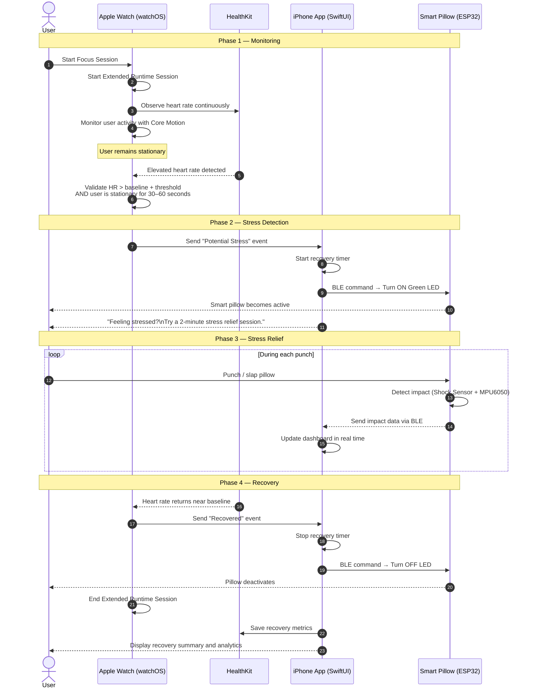

# Tech & Framework Challenge

> A project-based challenge that encourages teams to explore Apple technologies, experiment with Apple frameworks, and transform their learnings into a functional application.

This repository documents our team's journey throughout the **Tech & Framework Challenge**, where each team selects a technology theme, researches Apple's frameworks, explores different approaches, and develops a solution while documenting the entire engineering process—from initial assumptions to the final design decisions.

For this challenge, our team chose the **Internet of Things (IoT)** theme and built **[App Name]**, an application that integrates Apple frameworks with an IoT-enabled smart pillow to provide an interactive stress detection and relief experience.

---

# 📖 Overview

Stress often builds up silently during work or study sessions. While wearable devices can continuously monitor physiological signals, they rarely provide immediate physical intervention.

Our project explores how Apple frameworks can be combined with Internet of Things (IoT) technologies to bridge this gap. By leveraging **HealthKit**, **Core Motion**, and **Core Bluetooth**, the application detects potential stress episodes based on elevated heart rate during periods of inactivity, communicates with a Bluetooth-enabled smart pillow, and encourages users to engage in a guided stress-relief session. Following each session, users can review their recovery through an interactive analytics dashboard.

---

# ✨ Key Features

- ❤️ Continuous heart rate monitoring using Apple Watch
- 🧍 Stationary activity detection with Core Motion
- 📡 BLE communication with an ESP32-powered smart pillow
- 🥊 Interactive guided stress-relief session
- 📊 Recovery analytics dashboard
- 🔄 Real-time integration between Apple frameworks and IoT hardware

---

# 👥 Team
**Team Name:** IoTry

| Name | Role |
|------|------|
| Ahmad Taufiq Hidayat | Coder |
| Johnny Khang | Coder |
| Stevanus Felixiano | Coder |
| Valentica Ongke | Designer |
| Ni Ketut Lela Berliani | Designer |

---

# 🎯 Challenge Theme

Among several available challenge themes, we chose **Internet of Things (IoT)** because we wanted to explore how Apple frameworks can interact with physical devices rather than remaining purely software-based.

### Theme
- Internet of Things (IoT)

### Apple Frameworks
- **Core Bluetooth** *(Primary Framework)*
- **HealthKit**
- **Core Motion**

---

# 💡 Problem Statement

Many stress-monitoring applications stop at notifying users that they are stressed.

We wanted to answer a different question:

> **What if the app could immediately help users release stress through a connected physical device?**

---

# 🚀 Proposed Solution

Our solution consists of two main stages: **possible stress detection** and **stress relief**.

### Possible Stress Detection

- HealthKit continuously monitors heart rate using Apple Watch.
- Core Motion determines whether the user is stationary.
- Elevated heart rate during inactivity is interpreted as a potential stress episode.

### Stress Relief

- Core Bluetooth communicates with an ESP32-powered smart pillow.
- The pillow provides a visual cue by activating its LED.
- Users perform a short guided stress-relief session by interacting with the pillow.
- Recovery progress and session statistics are presented through an analytics dashboard.

---

# 🛠 Framework Integration

| Framework | Purpose |
|-----------|---------|
| **Core Bluetooth** | Communicates with the ESP32-powered smart pillow using Bluetooth Low Energy (BLE). |
| **HealthKit** | Continuously monitors the user's heart rate through Apple Watch. |
| **Core Motion** | Determines whether the user is stationary to reduce false stress detections. |

---

## Core Bluetooth *(Primary Framework)*

### Why We Chose It

Core Bluetooth enables seamless BLE communication between the iOS application and our custom IoT device. It acts as the bridge between digital health monitoring and physical interaction, making it the foundation of our solution.

### Responsibilities

- Discover nearby BLE devices
- Pair with the smart pillow
- Send activation commands
- Receive sensor data from the ESP32

---

## HealthKit

### Responsibilities

- Read heart rate data
- Monitor recovery progress
- Store health-related metrics

---

## Core Motion

### Responsibilities

- Detect stationary activity
- Reduce false positives caused by exercise
- Provide additional context for stress detection

---

## 🔄 System Workflow

```text
                 Apple Watch
                      │
      Continuously monitors heart rate
                      │
                      ▼
     Core Motion verifies user is stationary
                      │
                      ▼
 Heart Rate > Baseline + Threshold (30–60 sec)
                      │
                      ▼
      Possible Stress Episode Detected
                      │
                      ▼
     Notification sent to iPhone Application
                      │
                      ▼
 Core Bluetooth sends command to ESP32 Smart Pillow
                      │
                      ▼
         Smart Pillow activates (Green LED ON)
                      │
                      ▼
 User receives prompt:
 "Feeling stressed? Try a 2-minute stress relief session."
                      │
                      ▼
        User punches / slaps the smart pillow
                      │
                      ▼
  Impact Sensor (Shock Sensor + MPU6050) records impacts
                      │
                      ▼
      Recovery timer starts while monitoring HR
                      │
                      ▼
 Heart rate gradually returns near baseline
                      │
                      ▼
        Session ends automatically
                      │
                      ▼
 Dashboard displays recovery analytics,
 stress history, and impact statistics
```
---

## 📡 Detailed Interaction Flow


---

# 🧠 Starting Assumption

Before conducting any research, we assumed:

- Heart rate alone would be sufficient to detect stress.
- Bluetooth communication with an IoT device would be relatively straightforward.
- Apple Watch could continuously monitor stress without additional conditions.
- The biggest challenge would be building the physical smart pillow.

---

# 🔍 Exploration Log

Our research process focused on understanding each framework and validating whether our assumptions were correct.

### Step 1
Explored Apple IoT-related frameworks.

Considered:
- Core Bluetooth ✅
- Matter Support
- HomeKit

Result:
Core Bluetooth provided the flexibility required for a custom IoT device.

---

### Step 2

Investigated methods for stress detection.

Research included:

- Heart rate monitoring
- Motion detection
- HealthKit capabilities

Finding:

High heart rate alone generates many false positives.

---

### Step 3

Studied Apple Watch capabilities.

Finding:

Stress cannot be directly measured.

Instead, we infer stress by combining:

- elevated heart rate
- inactivity

---

### Step 4

Designed an appropriate IoT response.

Instead of sending notifications, we wanted a physical intervention.

This led to the smart punching pillow concept.

---

# ❌ What We Tried and Dropped

## Matter Support

Reason explored:
- Easier smart-home integration.

Why dropped:
- Requires Matter-compatible hardware.
- Less suitable for a fully custom prototype.

---

## HomeKit

Reason explored:
- Native Apple smart-home ecosystem.

Why dropped:
- Primarily designed for certified smart-home accessories.
- Less flexible than Core Bluetooth for our custom device.

---

## Heart Rate Only Detection

Reason explored:
- Simpler implementation.

Why dropped:
- Unable to distinguish stress from physical exercise.
- Too many false positives.

---

# ⚠️ Real Limitations

During development, we identified several practical limitations.

## HealthKit

- Cannot directly determine emotional stress.
- Depends on Apple Watch measurements.

---

## Core Motion

- Cannot guarantee emotional state.
- Only identifies whether the user is stationary.

---

## Core Bluetooth

- Limited BLE range.
- Requires pairing and connection stability.

---

## IoT Device

- Requires custom hardware.
- Motor inflation timing must be carefully calibrated.
- Battery life and portability remain challenges.

---

# 🔄 Revised Decision

After exploration, our approach evolved.

| Initial Idea | Final Decision |
|--------------|----------------|
| Detect stress from heart rate only | Combine heart rate + inactivity |
| Focus mainly on software | Integrate software with IoT hardware |
| Simple notification | Physical stress-relief intervention |
| Display heart rate | Provide recovery analytics dashboard |

---

# 📈 Recovery Analytics

The dashboard provides:

- Stress episode history
- Heart rate trends
- Recovery time
- Daily statistics
- Weekly analytics
- Session summaries

---

# 🔮 Future Improvements

### AI & Personalization

- Personalized stress prediction
- Adaptive stress thresholds
- Apple Intelligence integration

### User Experience

- Guided breathing exercises
- Apple Watch haptic feedback
- Adaptive pillow firmness

### Ecosystem

- Cloud synchronization
- Multi-device support
- Multi-user profiles

---

# 📚 Technology Stack

## Software

| Technology | Purpose |
|------------|---------|
| Swift | Application Development |
| SwiftUI | User Interface |
| Core Bluetooth | BLE Communication |
| HealthKit | Heart Rate Monitoring |
| Core Motion | Activity Detection |

## Hardware

| Component | Purpose |
|-----------|---------|
| Apple Watch | Heart Rate Monitoring |
| ESP32 | BLE Peripheral |
| MPU6050 | Motion Detection |
| Green LED | Provides a visual cue when a stress-relief session is triggered |
| Pillow | Stress-Relief Device |

---

# 🌟 Why This Project?

Our goal is to demonstrate how Apple frameworks can extend beyond traditional mobile applications by integrating with IoT devices to create richer and more interactive user experiences.

Rather than simply notifying users about elevated stress levels, our solution combines **HealthKit**, **Core Motion**, and **Core Bluetooth** to detect potential stress episodes, initiate an IoT-assisted intervention, and provide meaningful recovery insights. Through this project, we explore how Apple's ecosystem can seamlessly connect digital health monitoring with real-world interaction.
